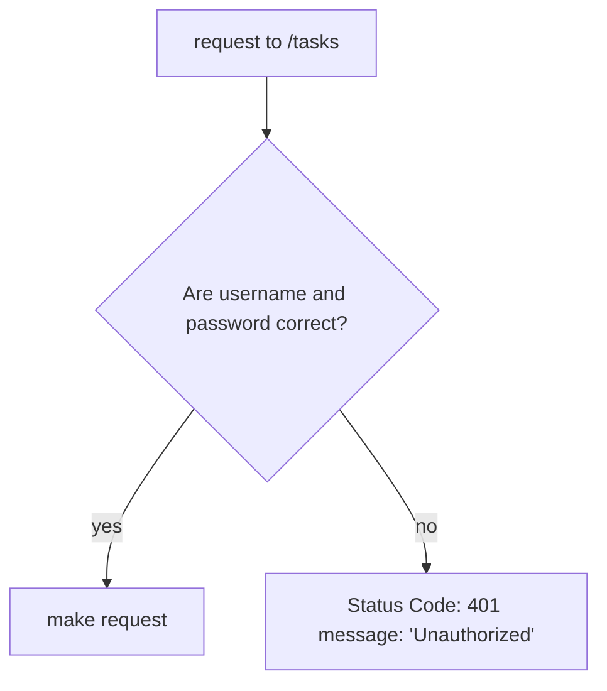

/**
 * This class represents a Spring Boot project that can be run with Maven.
 * To run the project, follow these steps:
 * 
 * 1. Make sure you have Maven installed on your system.
 * 2. Open a terminal or command prompt and navigate to the root directory of the project.
 * 3. Run the command "mvn spring-boot:run" to start the application.
 * 4. Once the application has started, you can access it by navigating to http://localhost:8080 in your web browser.
 */
# Todo List Project

This project is a simple Todo List application that allows users to create, read, update, and delete tasks.

## Installation

To install the project, simply clone the repository and run the following command:

<h1 align="center">
  
</h1>

<p align="center">
  
  
  
  
</p>

## 💻 Projeto

  Esse projeto é uma API REST, onde podemos cadastrar usuários que podrá gerenciar tarefas caso esteja autenticado, as tarefas que o usuário poderá gerenciar serão:
- Cadastrar uma tarefa;
- Listar suas tarefas;
- Editar as informações de uma tarefa;
- Excluir uma tarefa;

## 🧐 Diagramas

### Funcionamento das requisições
```mermaid
sequenceDiagram
    participant client
    participant auth
    participant /users
    participant /tasks
    participant repository
    client->>/users: (POST) body: { username, name, password }
    /users->>repository: { id, username, password, createdAt }
    /users->>client: { status: 201, "Usuário criado com sucesso" }
    client->>/tasks: (POST) body: { title, description, startAt, endAt, priority }, basicAuth: { username, password }
    /tasks->>auth: basicAuth: { username, password }
    auth->>/tasks: request: { ..., idUser }
    /tasks->>repository: { id, idUser, title, description, startAt, endAt, priority, createdAt }
    /tasks->>client: { status: 200, { id, idUser, title, description, startAt, endAt, priority, createdAt } }
    client->>/tasks: (GET) url_param: { id }, basicAuth: { username, password }
    /tasks->>auth: basicAuth: { username, password }
    auth->>/tasks: request: { ..., idUser }
    /tasks->>repository: { idUser }
    repository->>/tasks: [..., { id, idUser, title, description, startAt, endAt, priority, createdAt }]
    /tasks->>client: { status: 200, [..., { id, idUser, title, description, startAt, endAt, priority, createdAt }]}
    client->>/tasks: (PUT) url_param: { id }, basicAuth: { username, password }, body: { title, description, startAt, endAt, priority }
    /tasks->>auth: basicAuth: { username, password }
    auth->>/tasks: request: { ..., idUser }
    /tasks->>repository: { id }
    repository->>/tasks: { id, idUser, title, description, startAt, endAt, priority, createdAt }
    /tasks->>repository: { ...task, ...body }
    /tasks->>client: { status: 200, { id, idUser, title, description, startAt, endAt, priority, createdAt } }
    client->>/tasks: (DELETE) url_param: { id }, basicAuth: { username, password }
    /tasks->>auth: basicAuth: { username, password }
    auth->>/tasks: request: { ..., idUser }
    /tasks->>repository: { id }
    /tasks->>client: { status: 200, "Tarefa excluída com sucesso." }
```

### Sistema de autorização


## 💻 Tecnologias

Para a realização desse projeto foi utilizado o framework [Spring Boot](https://spring.io/projects/spring-boot) assim foi possível cadastrar minhas rotas e utilizar o potencial dos notations removendo uma camada de complexidade com a automação do spring-boot. As notations poupa bastante tempo de escrita de código com uma biblioteca robusta como o spring-boot, e para deixar o desenvolvimento mais eficiênte, foi utilizado o [lombok](https://projectlombok.org/) isso fez com que o desenvolvimento fosse feito em menos tempo e com uma qualidade de entrega melhor, pois deixou o código mais legível. Já para lidar com as persistencias no repository foi utilizado o [starter-data-jpa](https://knexjs.org/), e o [h2database](https://github.com/h2database/h2database) para a persistencia dos dados, por ser um projeto para fins de aprendizados, simplifica boa parte do processo.

## ✍️ Instrução

### Pré configuração.
>Para executar esse projeto será necessário ter o JDK17 e o maven instalado e configurado de acordo com seu sistema operacional.

Agora você deve executar o seguinte comando no seu terminal:
```bash
# instalação dos pacotes
$ mvn clean install

# Execução do servidor
$ mvn spring-boot:run
```

Agora você poderá testar com a utilização de uma ferramenta como por exemplo: [insomnia](https://insomnia.rest/) ou [postman](https://www.postman.com/)
